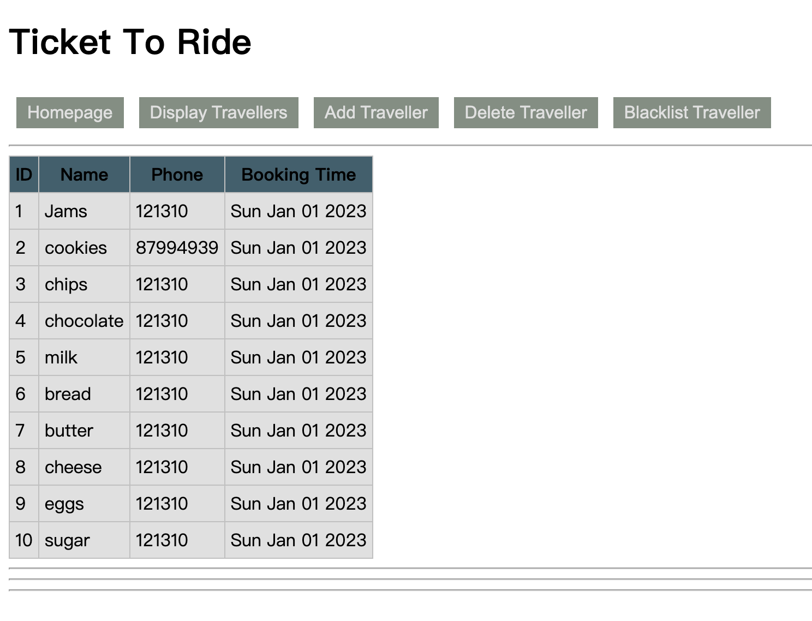
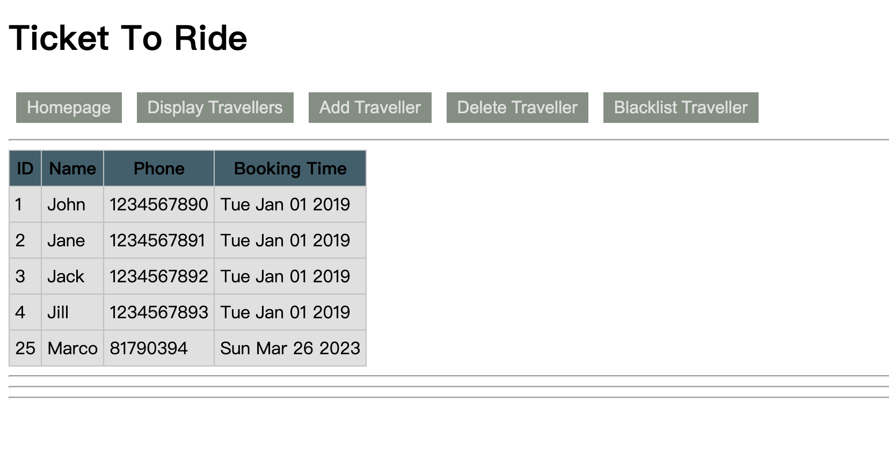

# Report for assiginment 4


## Github repo link and branch name    

- Repo link: https://github.com/IT5007-2220/assignment-4-Fazziekey
- Branch name: main

## Steps to set up application

```
docker load -i docker_image_mongo.tar

docker run -p 127.0.0.1:3000:3000/tcp --name tutorial4 -dit it5007_tutorial:t4 bash

npm install

npm run compile
```


## How to launch application

```
npm start
```

## All features implemented

### initialize the database

```shell
mongo tickettoride scripts/init.mongo.js

```
### show travelers 



### add

### delete

### blacklist

### css 


